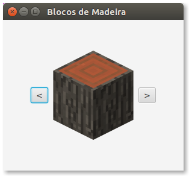

# Prática: Interfaces Gráficas com JavaFX


## Preparação


1. Estes exercícios tratam de **interfaces gráficas** em Java, usando o toolkit JavaFX. Para isso, é necessário entender os recursos de **orientação a objetos** estudados até então (herança, polimorfismo, interfaces, etc.).

2. Para estes exercícios, o ideal é que você tenha instalado o JDK 8 (Java Standard Edition Development Kit 8). Esta é a versão instalada no laboratório (sala 334). Em versões superiores, as classes do JavaFX estão [separadas do JDK distribuído pela Oracle](https://blogs.oracle.com/java-platform-group/the-future-of-javafx-and-other-java-client-roadmap-updates). Se você tiver instalado uma versão superior do JDK, consulte esta [documentação](https://openjfx.io/openjfx-docs/#install-javafx), que começa com o download do JavaFX [aqui](https://gluonhq.com/products/javafx/). 

3. Veja uma introdução a interfaces gráficas em JavaFX nos [slides](https://docs.google.com/presentation/d/1foLaaktwGGrgQAGcfYnHL63n2XIb6jv1tDZYibS_g68/edit?usp=sharing) da disciplina e na [documentação da Oracle](https://docs.oracle.com/javafx/2/).


## Exercícios

1. Baixe o programa [HelloButtonLabel.java](src/HelloButtonLabel.java). Compile-o e execute-o usando seu IDE preferido, ou faça isso diretamente num terminal:
   ```
   $ javac HelloButtonLabel.java
   $ java -cp . HelloButtonLabel
   ```

2. Usando como referência o exemplo acima e o programa [HelloImage.java](src/HelloImage.java), você deverá construir um programa para visualizar [6 tipos de blocos de Madeira do jogo Minecraft](src/madeiras.zip), um de cada vez. A interface do programa deverá ter botões para avançar e retroceder a visualização da lista de blocos, conforme o exemplo ao lado.
    
   
   
   **Observação**: os programas de exemplo usam as classes `VBox` e `StackPane` para o layout dos objetos na interface gráfica. Para este exercício, você deverá usar outra classe de layout. Para saber mais sobre layouts em JavaFX, veja este [tutorial da Oracle](https://docs.oracle.com/javafx/2/layout/builtin_layouts.htm).
