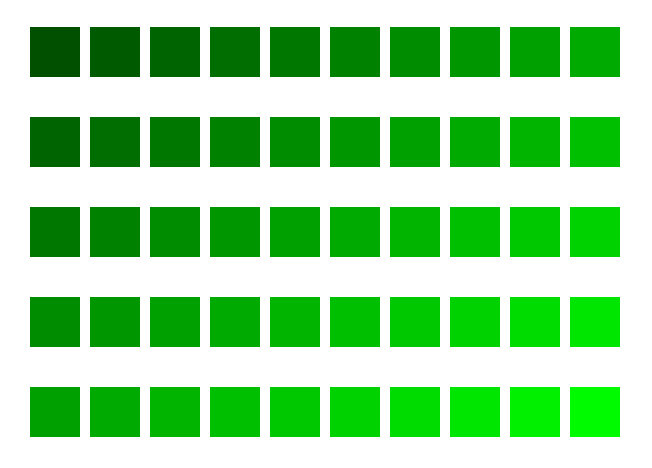

# Trabalho 2: Geração de SVG em Haskell

## Deadline

Domingo, 14 de abril, 23:59.

## Trabalho

Neste trabalho, você vai criar um programa em Haskell para gerar arquivos em formato SVG com formas geométricas coloridas, dispostas em alguns padrões.

Você deverá gerar no mínimo 4 padrões diferentes, inspirados nas figuras abaixo:

| Caso 1 | Caso 2 | Caso 3 | Caso 4 |  
| --- | --- | --- | --- |  
|  |  |  |  |  
| [case1.svg](case1.svg) | [case2.svg](case2.svg) | [case3.svg](case3.svg) | [case4.svg](case4.svg) |  

Para isso, seu programa nomeado `t2.hs` deverá implementar 4 funções: 
- `genCase1 :: IO ()` : gera matriz de retângulos de cores diferentes
- `genCase2 :: IO ()` : gera círculos dispostos sobre um círculo
- `genCase3 :: IO ()` : gera matriz com círculos sobrepostos
- `genCase4 :: IO ()` : gera círculos dispostos sobre senoides

A geração de figuras e cores deve ser feita programaticamente, por meio de funções que você terá que definir. Nessas funções, evite usar valores *hard-coded*. Calcule posições e cores a partir de argumentos passados para as funções, definindo constantes quando necessário.

As figuras que você vai gerar não precisam ser idênticas aos casos acima, mas devem seguir os mesmos padrões. Para cada caso, você pode variar as cores, a quantidade de figuras, a quantidade de repetições e o espaçamento entre as figuras.

## Entrega

 1. Seu trabalho será entregue no seu **repositório** remoto da disciplina, no GitHub. Este repositório deve ter sido informado quando você respondeu o questionário indicado pela professora no primeiro dia de aula. 

 2. No seu repositório local, crie uma pasta chamada `t2` (atenção: **letra minúscula**).

 3. Dentro da pasta `t2`, coloque os arquivos `t2.hs` e `ghci_history`. Caso seu arquivo `ghci_history` esteja vazio, copie e cole dentro dele sua interação com o `ghci`.

 4. A cada caso que você desenvolver e testar, faça `commit` para gerar um registro no seu repositório. Ao final, faça `push` para o repositório remoto no GitHub.

## Ideias de atividades personalizadas

 1. Implemente outos padrões geométricos à sua escolha, produzindo outros casos além dos 4 acima. Veja algumas ideias aqui: https://en.wikipedia.org/wiki/Overlapping_circles_grid

 2. Implemente diferentes paletas de cores, usando informações sobre teoria de cores. Por exemplo, descubra como converter cores HSC para RGB e implemente a geração de uma paleta tipo 'arco-íris'.

 3. Implemente uma interface que facilite a escolha de diferentes formas e cores no seu programa.

## Material de apoio

- [svgPatterns.hs](svgPatterns.hs)  
  Código em Haskell que gera um padrão simples com retângulos coloridos.

- [Tutorial SVG](https://www.w3schools.com/graphics/svg_intro.asp)  
  Tutorial SVG no W3Schools

- [Basic Color Schemes: Introduction to Color Theory](http://www.tigercolor.com/color-lab/color-theory/color-theory-intro.htm)  
  Texto introdutório sobre teoria das cores.

